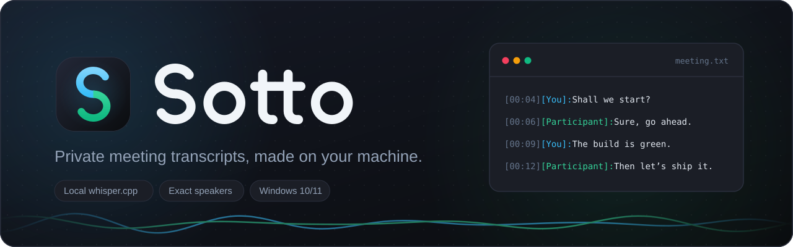

<p align="center">
  
</p>

<p align="center">
  <a href="https://github.com/SecretLUL/Sotto/releases/latest"></a>
  <a href="https://github.com/SecretLUL/Sotto/actions/workflows/ci.yml"></a>
  <a href="LICENSE"></a>
</p>

Sotto records your microphone and the system audio as two separate tracks and turns a meeting into a transcript that knows who said what. Transcription runs locally with [whisper.cpp](https://github.com/ggml-org/whisper.cpp), or in the cloud with ElevenLabs Scribe if you choose it. The name comes from *sotto voce*, in a low voice: with the local engine, nothing that is said leaves your machine.

## Features

- **Exact speakers**: your voice and everyone else's are recorded on separate tracks, so every line is marked `[You]` or `[Participant]` without guessing.
- **Local and private**: whisper.cpp runs on your machine. Models from tiny (75 MB) to large-v3 (3.1 GB) are downloaded on first use and checked against their published SHA-256.
- **Live transcription**: with a local model the recording is transcribed while it runs, so Stop only has to catch up with the last seconds.
- **File upload**: transcribes existing recordings. WAV, MP3, FLAC and OGG are read directly; M4A, AAC, WMA, MP4, WebM and Opus need FFmpeg on the `PATH`.
- **Nothing gets lost**: it warns before a recording is overwritten, offers to process recordings that were interrupted, and checks the engine, the output folder and the free disk space before it starts.
- **Updates itself**: at start it asks GitHub for a newer release and shows a banner. "Update now" downloads it in the background, checks it against the release's `SHA256SUMS.txt`, and installs it on restart or when you close Sotto. Models, recordings and settings stay where they are.
- **Optional**: ElevenLabs Scribe as a cloud engine, and a GPU switch that falls back to the CPU if the GPU run fails. `F5` starts and stops a recording.

## Download

Get the archive for your system from the [latest release](https://github.com/SecretLUL/Sotto/releases/latest), extract it and start `Sotto`.

| System | Archive | System audio |
| :--- | :--- | :--- |
| Windows 10/11, x64 | `Sotto-<version>-windows-x64.zip` | WASAPI loopback, built in |
| Linux, x64 | `Sotto-<version>-linux-x64.tar.gz` | PulseAudio or PipeWire monitor |
| macOS, Apple Silicon | `Sotto-<version>-macos-arm64.zip` | a loopback driver such as [BlackHole](https://github.com/ExistentialAudio/BlackHole) |

- On Windows the whisper.cpp engine is downloaded automatically. On Linux and macOS, install it so that `whisper-cli` is on the `PATH` (macOS: `brew install whisper-cpp`), or use ElevenLabs.
- On an Intel Mac, run from source or build with `python build_release.py`.
- Models (`bin/`), recordings (`output/`) and `settings.json` are kept next to the executable. Where that folder is not writable, and always on macOS, they go to `%LOCALAPPDATA%\AudioTranscriber`, `~/Library/Application Support/AudioTranscriber` or `~/.local/share/AudioTranscriber`. `AUDIO_TRANSCRIBER_HOME` overrides this.
- Updates install themselves on Windows and Linux (Settings → "Check for updates at start" turns the check off). On macOS, or when Sotto's folder is not writable, the banner links to the download instead. Versions up to 2.0.2 have no updater yet: install the first one that does by hand.
- Coming from 2.0 or older, whose folder was called `AudioTranscriber`: extract Sotto next to that folder or into it. On its first start Sotto moves the models, recordings and settings over.

## Run from source

```shell
git clone https://github.com/SecretLUL/Sotto.git
cd Sotto
pip install -r requirements.txt
python main.py
```

On Windows, `Start-Recorder.vbs` starts it without a console window.

## How speakers are told apart

The two tracks are transcribed separately instead of being mixed and guessed apart afterwards. `diarize.py` then decides every line:

1. Sound from the speakers that bleeds into the microphone is dropped by comparing the level of both tracks.
2. Segments without signal on their own track are dropped as hallucinations.
3. A sentence recognised on both tracks is kept once, from the clearer one.

## Development

```shell
python run_tests.py               # test suite
python build_release.py v1.2.0    # standalone build and archive in dist/
```

The code lives in `audio_transcriber/`: `audio/` captures and loads audio, `transcribe/` runs whisper.cpp and ElevenLabs, `diarize.py` merges the tracks and `ui/` is the Tkinter interface.

To release, run the [Release workflow](https://github.com/SecretLUL/Sotto/actions/workflows/release.yml) from `main` and pick `patch`, `minor` or `major`. It counts on from the newest tag, builds all three platforms, then tags and publishes them with checksums. The rehearsal option builds without publishing.

## License

[MIT](LICENSE)
